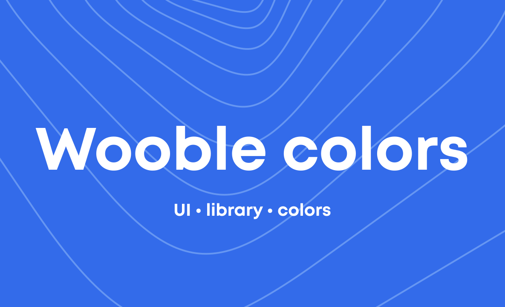

<p align="center">
	<a href="https://ui.wooble.team">
		
	</a>
</p>

<h1 align="center">It's wooble colors</h1>

<p align="center">
	Color palette of It's wooble UI.
</p>

## 📦 Install

```bash
npm install @itswooble/colors
```

```bash
yarn add @itswooble/colors
```

## 🔨 Usage

```jsx
import React from 'react';
import { green300 } from '@itswooble/colors';

const App = () => (
	<>
    	<button style={{ backgroundColor: green300 }}>PRESS ME</button>
  	</>
);
```

### TypeScript

`@itswooble/colors` is written in TypeScript with complete definitions.

## 🔗 Links

- [Home page](https://ui.wooble.team/)
- [Components Overview](https://ui.wooble.team/docs)
- [It's wooble Icons](https://ui.wooble.team/icons)
- [Npm page](https://www.npmjs.com/package/@itswooble/ui)

## ⌨️ Development
Clone locally:

```bash
$ git clone git@github.com:wooble-team/wooble-colors.git
$ cd wooble-colors
```

## 💾 Exports
|      name      |                        description                       |
|:--------------:| :-------------------------------------------------------:|
|     colors     | Object with keys - color names, values ​​- their hex codes |
| colorsVariants |                Array with all color names                |
|     Colors     |                Type with all color names                 | 
|     black      |                          #252525                         |
|     white      |                          #FFFFFF                         |
|    gray100     |                          #F2F2F2                         |
|    gray200     |                          #E0E0E0                         |
|    gray300     |                          #BDBDBD                         |
|    gray400     |                          #828282                         |
|    gray500     |                          #4F4F4F                         |
|      red       |                          #EB5757                         |
|     orange     |                          #F2994A                         |
|     yellow     |                          #F2C94C                         |
|    green100    |                          #6FCF97                         |
|    green200    |                          #2D9CDB                         |
|    green300    |                          #2F80ED                         |
|    blue100     |                          #56CCF2                         |
|    blue200     |                          #2D9CDB                         |
|    blue300     |                          #2F80ED                         |
|   purple100    |                          #BB6BD9                         |
|   purple200    |                          #9B51E0                         |

## 👋 Founders  
- [Kirill Osintsev](https://github.com/crashzky)
- [Dmitriy Gorbunov](https://github.com/DimaGorbusha) 
- [Alexander Isakov](https://dribbble.com/Alexis4049)
- [Sofia Sokolova](https://www.behance.net/sofa_sofkrad)